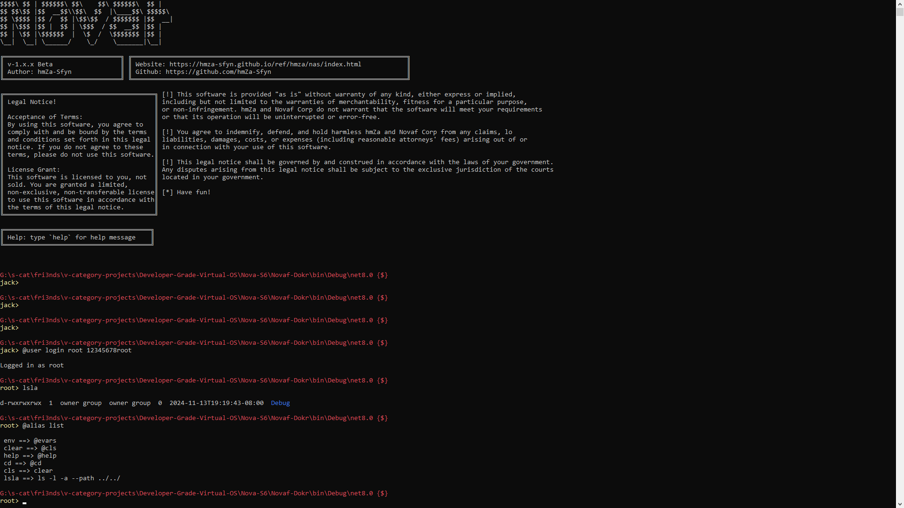
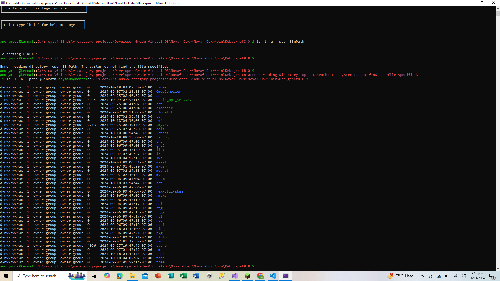

<p align="center" style="font-size:40px;">
 Nova-S6 (ISE) <br> Integrated Shell Environment
</p>


## Version 4.2.yz.24 (Current)
- Modified shell `hqsh`
- Introduced basic command sets including:
  - Basic commands (echo, echoln)
  - Mind storage system
  - Register commands
  - Environment variable management
  - Added custom macro command, now you can create custom macros which will act like commands.

### Commands 

## Builtin Commands
```bash
# Echo Commands
echo      # Echo text without newlines
echoln    # Echo text with each argument on a new line

# Mind Storage Commands
mind -add item1 item2 item3    # Add items to storage
mind -get 1                    # Get item at index 1
mind -list                     # Show all stored items

# Register Storage Commands
reg>>set>>key>>value     # Set a key-value pair
reg>>get>>key            # Get value for a key
reg>>list                # List all registered key-value pairs

# Directory Navigation
cd directory_path      # Change directory

# Environment Variables
$$env::variableName           # Get value of specific variable
$$env>>variableName>>value    # Set environment variable
$$env>>$all                   # List all environment variables
$$env>>$rem>>variableName     # Remove environment variable
```

## File Management Commands
```bash
file create filename content  # Create new file with content
file read filename           # Display file content
file delete filename         # Delete specified file
file append filename content # Append content to file
file rename oldname newname  # Rename file
file copy source destination # Copy file
file info filename          # Show file information
file exists filename        # Check if file exists
file lines-count filename   # Count lines in file
file search filename text   # Search for text in file
file encrypt filename       # Encrypt file
file decrypt filename       # Decrypt file
file compress filename      # Compress file
file decompress filename    # Decompress file
file hash filename          # Generate SHA-256 hash
file watch filename         # Monitor file for changes
file temp [content]         # Create temporary file
```

## Directory Management Commands
```bash
dir create dirname            # Create new directory
dir list dirname             # List directory contents
dir delete dirname           # Delete directory
dir rename oldname newname   # Rename directory
dir exists dirname           # Check if directory exists
dir info dirname             # Show directory information
dir size dirname             # Calculate directory size
dir count-files dirname      # Count files in directory
dir count-dirs dirname       # Count subdirectories
dir backup dirname           # Create directory backup
dir clean dirname            # Remove all contents
dir find dirname pattern     # Find files matching pattern
dir monitor dirname          # Monitor directory changes
```

## Network Commands
```bash
# TCP Operations
net tcp-connect hostname port [message]  # Establish TCP connection
net tcp-server port                      # Create TCP server

# Email Operations
net smtp-send server port username password to subject body  # Send email

# Security Checks
net rdp-check hostname                   # Check RDP port accessibility
net ssl-check hostname                   # Check SSL certificate

# Basic Network Operations
net ping hostname                        # Test connectivity
net gethost hostname                     # Get host information
net getip hostname                       # Resolve domain name to IP
net scan-ports hostname startPort endPort # Scan port range
net traceroute hostname                  # Trace route to destination
net whois domain                         # Perform WHOIS lookup

# Network Monitoring
net listen port                          # Create network listener
net netstat                              # Show active connections
net check-connection                     # Verify network connectivity
net bandwidth-test                       # Test download speed

# File Transfer
net download url localfile               # Download file from URL
net http-get url                         # Perform HTTP GET request

# Network Information
net mac                                  # Display MAC addresses
net route                               # Show routing information

# UDP Operations
net send-packet host port message        # Send UDP packet
```

## Version 2.0.0 (5/11/2024)


### New Features
- Added anathor shell interface `hqsh`
- Introduced shell builtin functions and macros
- Added custom assembly language
- Added custom scripting language
- New style: `type-zza`

### Key Improvements
- Enhanced scripting capabilities with personal finance tracking functionality
- Improved system stability and performance

## Version 1.4.9 (5/11/2024)


### System Resource Management
- Introduced `@system` command suite for system resource management
- Added pointer management functionality
- New commands for system configuration and resource handling
- Enhanced CTRL+C control
- Fixed @exit command behavior

### Main Features
- Configuration file support
- Improved customization options
- Enhanced resource management capabilities

## Version 1.1.0 (5/10/2024)



### Major Additions
- Comprehensive user management system
- Network node management (`f-Net` commands)
- Request handling system

### New Command Sets
- User Commands (@user)
  - User listing, addition, removal
  - Login/logout functionality
  - User information retrieval
- Network Commands (@fnet)
  - Node management
  - Network connectivity
  - System statistics
- Request Commands (@req)
  - HTTP request handling
  - Multiple request types (GET, POST, PUT, DELETE)
  - Advanced request options

## Version 0.1.0 (5/10/2024)
### Initial Release
- Basic network and user commands
- Bug fixes and core functionality
- Foundation for f-Net protocol

---

## Future Development
The f-Net protocol is under active development with planned features including:
- Friendly testing network
- API-friendly network
- Media storage optimization
- Enhanced security protocols
- Cloud sharing capabilities
- Gaming and streaming optimizations
- IoT device synchronization
- Decentralized data handling

Community contributions are welcome and encouraged for all aspects of development.